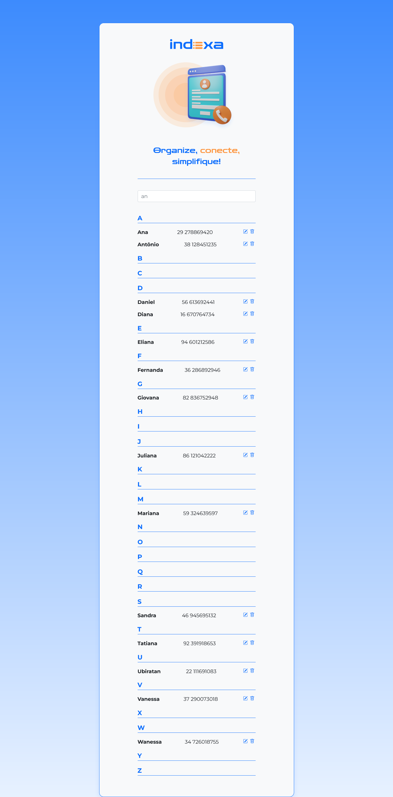

# 📒 Projeto Agenda de Contatos com Angular

Este é um projeto desenvolvido durante o curso de Angular da Alura, com o objetivo de criar uma aplicação web para agendamento de contatos.

<p align="center">
  
</p>


## 🌟 Funcionalidades

- **🎨 Cabeçalho estilizado:** Implementação de um cabeçalho com o título da aplicação e um design atraente, utilizando Flexbox para o alinhamento dos elementos e fontes personalizadas do Google Fonts.
- **💅 Estilização personalizada:** Aplicação de estilos CSS para melhorar a aparência da aplicação, utilizando cores, fontes e espaçamentos definidos no Figma.
- **🔤 Importação de fontes:** Utilização do Google Fonts para importar fontes personalizadas e aplicá-las ao projeto.

## 🛠️ Tecnologias Utilizadas

- **⚡ Angular:** Framework JavaScript para construção de interfaces de usuário.
- **📄 HTML:** Linguagem de marcação para estruturar o conteúdo da página.
- **🎨 CSS:** Linguagem de estilo para definir a aparência da página.
- **🎯 Figma:** Ferramenta de design utilizada como referência para a estilização da aplicação.
- **🖊️ Google Fonts:** Serviço de fontes online para importar fontes personalizadas.

## 🚀 Como Executar o Projeto

1. Clone este repositório:

```bash
git clone [URL do seu repositório]
```

2. Navegue até o diretório do projeto:

```bash
cd [nome do diretório do projeto]
```

3. Instale as dependências:

```bash
npm install
```

4. Execute a aplicação:

```bash
ng serve
```

5. Abra o navegador e acesse [`http://localhost:4200/`](http://localhost:4200/).

## 📂 Estrutura de Arquivos

```
src/
├── app/
│   ├── cabecalho/
│   │   ├── cabecalho.component.ts
│   │   ├── cabecalho.component.html
│   │   └── cabecalho.component.css
│   ├── app.component.ts
│   ├── app.component.html
│   ├── app.component.css
│   └── app.module.ts
├── styles.css
├── README.md
├── package.json
└── angular.json
```

## 📌 Próximos Passos

- ✅ Implementar a listagem de contatos.
- ➕ Adicionar funcionalidade para novos contatos.
- ✏️ Implementar edição e exclusão de contatos.

## 👨‍💻 Autor

- **Diego Pujol** - [GitHub](https://github.com/ThePujol/)